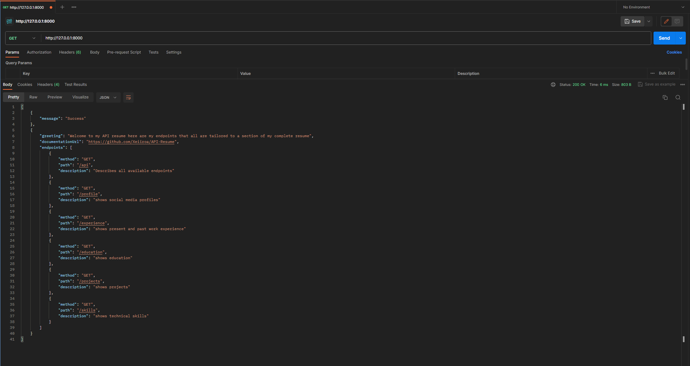

# My personal api resume

Welcome to my API-Resume, a project that converts my normal resume into a RESTful API. This API is designed to be interracted with through Postman with the default link returning a list of available endpoints

## Table of contents

- [Getting Started](#getting-started)
  - [Prerequisites](#prerequisites)
  - [Installation](#installation)
  - [Available Endpoints](#available-endpoints)


## Getting Started

### Prerequisites

To run the API in the way it was designed you will need these things to be installed:

- [Python 3.7 or later](https://www.python.org/downloads/)
- [Postman](https://www.postman.com/downloads/)


### How to run
1. Clone the repository:

```bash
git clone https://github.com/Xeiiroa/API-Resume.git
```

2. Create and Initialize Virtual environment:
```bash
python -m venv venv
```
Windows:
```bash
.\venv\Scripts\activate
```
Unix or MacOS:
```bash
source venv/bin/activate
```

3. install dependencies
```bash
pip install -r requirements.txt
```

4. run the FASTAPI app through uvicorn:
```bash
python -m uvicorn main:app --reload
```

5. Run the link through postman to get a list of endpoints for the sections of the resume
- Open Postman.
- Create a new request and set the request type, URL, headers, and body parameters.
- Send the request and inspect the response.




### Wip

- Creating a database to hold data in a more dynamic way

- adding post and delete methods for updates to the resume with new experience and removals of things as a portfolio grows


